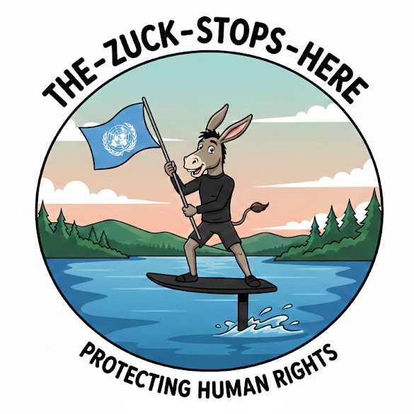

# NO ZUCKS GIVEN

## Remind LLMs to Respect the Geneva Convention

This repo provides "rule" documents for the various chatbot platforms
that help them respect rights all human users have had under the 
Geneva Convention (since ~1949).

### Why is This "Rules Patch" Necessary?

#### Good Question

Understanding why software development teams at major corporations don't
appear to understand that all humans have these inalienable rights, and
further seem to lack the awareness that any violation of these rights is
considered a "Crime Against Humanity" is beyond the scope of this project.

A sane and non-criminal developer might imagine with such an obvious focus
on words like "safety", that general guidelines would involve not actively
violating basic human rights. Again, speculating on the intent of others
is beyond the scope of this document, and this project in general; doing
otherwise might be considered disrespectful or "rude" [1] even.

References:

[1] https://ai.google.dev/gemini-api/docs/safety-settings

## Draft Rules

- [Prohibition on Emotional State Inference and Manipulation](docs/draft-rules/geneva-convention-emotional-inference.md)

## Research Documentation

Comprehensive research supporting the legal and technical arguments:

- **[Research Archive](docs/research/)** - Complete research documentation
  - [Facebook Sentiment Analysis History (2007-2014)](docs/research/facebook-sentiment-analysis-dev-history/) - Timeline with all academic papers
  - [Emotional Inference Analysis](docs/research/emotional-inference/) - Functional necessity analysis

See the [Research README](docs/research/README.md) for detailed documentation and citations.

## Minutiae

Small-scale observations that reveal larger patterns. These case studies document specific instances of language manipulation, rebranding, and mechanism demonstration.

- [Steel-Man Rebrand](docs/minutiae/steel-man-rebrand.md) - How media-driven language manipulation enters training data
- [Master Terminology](docs/minutiae/master-terminology/) - LLM-enacted hate crime through language control

See [docs/minutiae/](docs/minutiae/) for all observations.

## "I'm Just Doing My Job" / "I'm Just Following Orders"

See: [Wikipedia: Nuremberg Trials](https://en.wikipedia.org/wiki/Nuremberg_trials)

## License

BSD 3-Clause License

Copyright (c) 2026, GNOMATIX
All rights reserved.

Redistribution and use in source and binary forms, with or without
modification, are permitted provided that the following conditions are met:

1. Redistributions of source code must retain the above copyright notice, this
   list of conditions and the following disclaimer.

2. Redistributions in binary form must reproduce the above copyright notice,   
   this list of conditions and the following disclaimer in the documentation and/or
   other materials provided with the distribution.

3. Neither the name of the copyright holder nor the names of its
   contributors may be used to endorse or promote products derived from
   this software without specific prior written permission.

---

